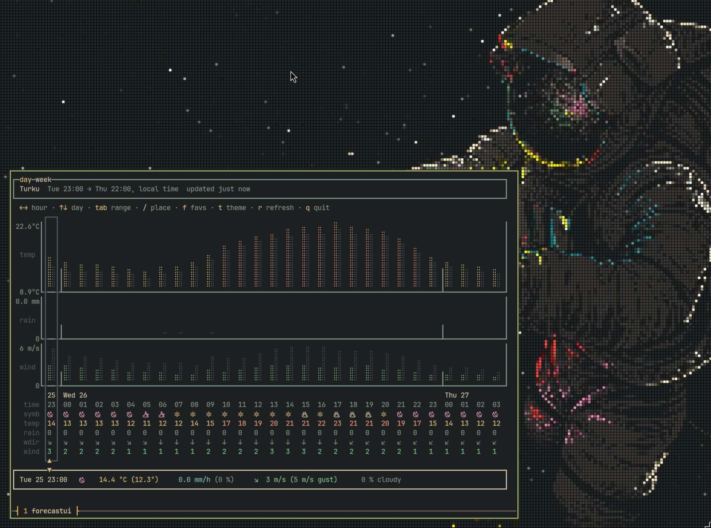

# forecastui

A terminal dashboard for the Finnish Meteorological Institute's forecast. It
reads FMI's open data (`pal_skandinavia`). Requires a nerd font to be set as the
terminal font for all features.

## Install

Linux and macOS:

```bash
curl -fsSL https://raw.githubusercontent.com/olli-io/forecastui/main/install.sh | bash
```

Windows (PowerShell):

```powershell
irm https://raw.githubusercontent.com/olli-io/forecastui/main/install.ps1 | iex
```

On a platform with no published binary, `install.sh`
builds from source instead, which needs the Go toolchain and `git`.

[release]: https://github.com/olli-io/forecastui/releases/latest
[releases page]: https://github.com/olli-io/forecastui/releases

### From source

> [!NOTE]
> Requires the Go toolchain and `git`.

```bash
go install github.com/olli-io/forecastui/cmd/forecastui@latest
```

Unlike the install scripts above, this leaves `PATH` alone. Add it to run 'forecastui' in terminal:

```bash
# in ~/.bashrc or ~/.zshrc
export PATH="$PATH:$(go env GOPATH)/bin"
```

```powershell
[Environment]::SetEnvironmentVariable('Path',
  "$([Environment]::GetEnvironmentVariable('Path', 'User'));$(go env GOPATH)\bin",
  'User')
```

## Theming

Themes are TOML files in `themes/` under the config directory
(`~/.config/forecastui` on Linux, `~/Library/Application Support/forecastui` on
macOS, `%AppData%\forecastui` on Windows). The bundled ones are written on first
run; your edits and your own files are left alone. Pick one in `config.toml`:

```toml
theme = "gruvbox-material"
```

```toml
fg     = "#d5c4a1"   # labels
grey   = "#7c6f64"   # axes, grid, headings
dim    = "#504945"   # probability of precipitation, cursor frame, selection
purple = "#d3869b"   # coldest temperatures, moonlit hours
aqua   = "#89b482"   # cold, snow
green  = "#a9b665"
yellow = "#d8a657"   # active tab, keys, clear sky
orange = "#e78a4e"
red    = "#ea6962"   # hottest temperatures, gales, thunder
blue   = "#7daea3"   # rain
```

A colour is a hex value (`"#d5c4a1"`, `"#fff"`), a 0-255 palette index
(`"213"`), a terminal colour name (`"blue"`, `"bright-black"`), or `"default"`.
`NO_COLOR` turns colour off entirely.

## Screenshot



