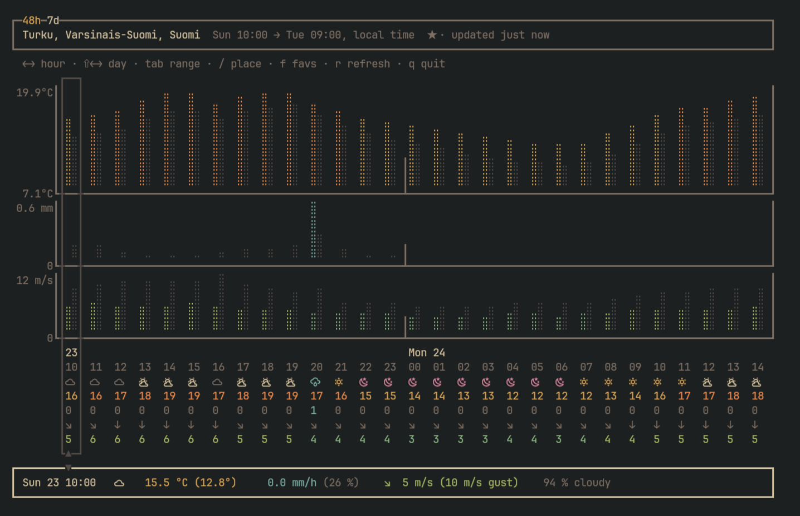

# forecastui

A terminal dashboard for the Finnish Meteorological Institute's forecast. It
reads FMI's open data (`pal_skandinavia`). Requires a nerd font to be set as the
terminal font for all features.

## Install

Linux and macOS:

```bash
curl -fsSL https://raw.githubusercontent.com/olli-io/forecastui/main/install.sh | bash
```

Windows (PowerShell):

```powershell
irm https://raw.githubusercontent.com/olli-io/forecastui/main/install.ps1 | iex
```

On a platform with no published binary, `install.sh`
builds from source instead, which needs the Go toolchain and `git`.

[release]: https://github.com/olli-io/forecastui/releases/latest
[releases page]: https://github.com/olli-io/forecastui/releases

### From source

> [!NOTE]
> Requires the Go toolchain and `git`.

```bash
go install github.com/olli-io/forecastui/cmd/forecastui@latest
```

Unlike the install scripts above, this leaves `PATH` alone. Add it to run 'forecastui' in terminal:

```bash
# in ~/.bashrc or ~/.zshrc
export PATH="$PATH:$(go env GOPATH)/bin"
```

```powershell
[Environment]::SetEnvironmentVariable('Path',
  "$([Environment]::GetEnvironmentVariable('Path', 'User'));$(go env GOPATH)\bin",
  'User')
```

## Screenshot



